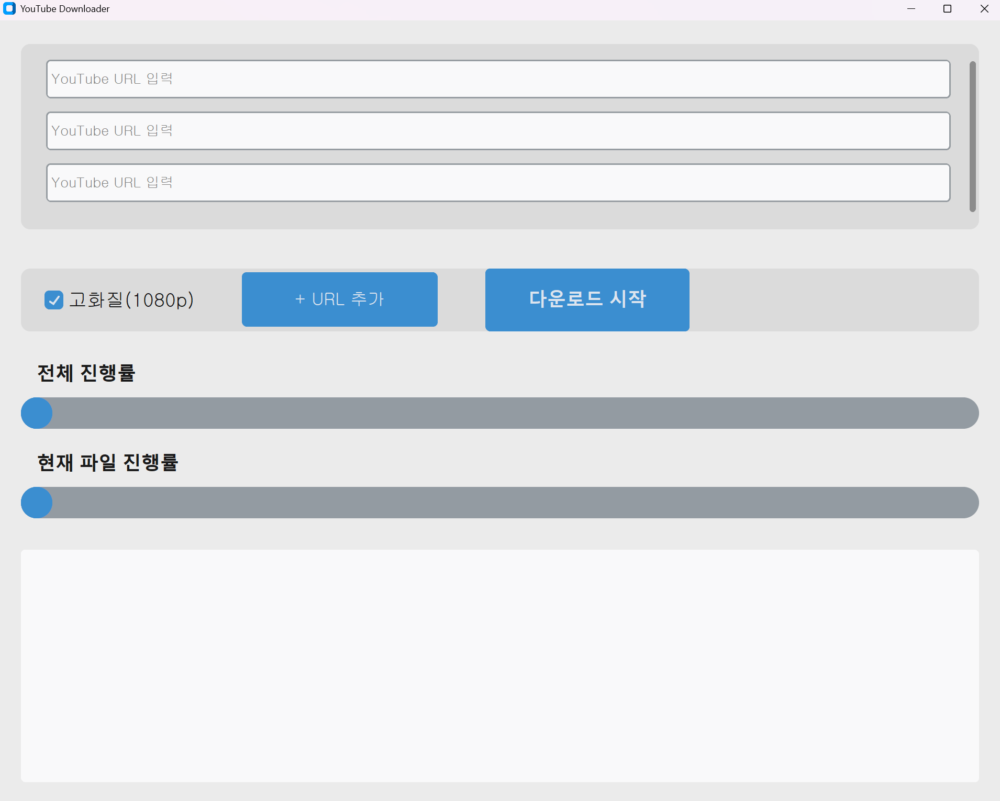

# 🎬 YouTube Downloader (Tkinter GUI)

간단한 Tkinter 기반 YouTube Downloader(GUI)입니다.  
**1080p 이상 고화질**(DASH)도 지원하며, ffmpeg로 **영상+오디오**를 자동 병합합니다.
[]()
[]()
[]()
<p align="left">
  
</p>


---

## 🚀 Features
- ✅ YouTube URL 입력 후 영상 다운로드
- ✅ 720p 또는 1080p 고화질 다운로드 지원
- ✅ 한국 오디오 트랙 우선 적용.
- ✅ ffmpeg을 이용한 영상+오디오 병합
- ✅ PyInstaller로 빌드하여 실행 파일 빌드.
- ℹ️ 왜 ffmpeg이 필요한가? 
 1080p 이상은 YouTube가 영상과 오디오를 분리 스트림(DASH) 으로 제공하는 경우가 많아, 다운로드 후 ffmpeg로 병합이 필요합니다.
---

## 📦 Requirements
- Python **3.10+**
- Windows
- [ ffmpeg-release-essentials.zip(v8.0)](https://www.gyan.dev/ffmpeg/builds/) 다운로드 후 프로젝트의 `ffmpeg/` 폴더에 압축해제.
- environment.yml
---

## 🛠 저장소 클론

    git clone https://github.com/kimtaegyu1223/tubeDownloader.git
    cd tubeDownloader
    
---

## ▶️ Usage

```bash
python main.py
```

- 기본 영상 저장 경로: 다운로드/youtube_downloads/
---

## 📦 실행파일 빌드

- PyInstaller를 사용해 단일 실행파일(exe)을 만들 수 있습니다.
```bash
pyinstaller --onefile --windowed --add-data "ffmpeg;ffmpeg" main.py
```
---

## 📂 Project Structure
```bash
tubeDownloader/
├── main.py               # 실행 진입점 (Tkinter UI)
├── downloader.py         # 다운로드 로직
├── utils.py              # 유틸 함수 (ffmpeg 경로, sanitize 등)
├── ffmpeg/               
│   └── bin/              # ffmpeg 바이너리 위치
└── README.md
```
---
## ⚠️ Disclaimer

This project is created for educational and personal learning purposes.
Downloading YouTube videos may violate the copyright laws of the respective country and the YouTube Terms of Service.
The user assumes all legal responsibility for any consequences that arise from using this project.

---
## 📜 License
[MIT License](./LICENSE)